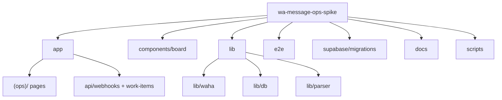

# Repository layout

Evidence: directory listing and source paths as of pipeline run (no git history in this workspace).

## Top-level responsibilities

| Path | Role |
|------|------|
| `app/` | Next.js App Router: root layout, `app/(ops)/` board routes, `app/api/webhooks/waha`, `app/api/work-items/[id]/context` |
| `components/board/` | `PageShell`, `OpsNav`, `WorkBoardTable`, `WorkBoardDetailPanel`, context helpers |
| `lib/` | Supabase clients, WAHA verify/normalize/raw-audit, parser (`classify-message`), DB upserts and shipment helpers, `lib/types/work-item.ts` |
| `e2e/` | Playwright smoke (`work-board.smoke.spec.ts`) |
| `supabase/migrations/` | `0001` ops_private + public core, `0002` RLS + Realtime, `0003` mm raw audit + shipment, `0004` work_item shipment FK |
| `scripts/` | `package.ps1`, `package-standalone.ps1` |
| `docs/` | Project docs: this file, `SYSTEM_ARCHITECTURE`, `GUIDE`, `CHANGELOG`, plus `implementation/`, `project-plan/`, `project-upgrade/`, `wa-parity-report.md` |

## Entrypoints

- **Dev server:** `pnpm dev` → Next.js on port **3006** (`package.json`).
- **Webhook (HTTP):** `POST /api/webhooks/waha` (`app/api/webhooks/waha/route.ts`).
- **Board UI:** `/work-board`, `/hold`, `/owner-board` under `app/(ops)/`.

## Structure (high level)

## Related docs

- Runtime and data flow: [`SYSTEM_ARCHITECTURE.md`](SYSTEM_ARCHITECTURE.md)
- Setup and troubleshooting: [`GUIDE.md`](GUIDE.md)
