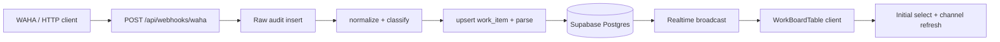

# System architecture

**Purpose:** Standalone Next.js spike for a message-driven **Work Board**: ingest WAHA-style webhooks, persist raw + derived rows in Supabase, expose `work_item` to the browser with Realtime updates.

Evidence: `app/api/webhooks/waha/route.ts`, `lib/waha/*`, `lib/db/*`, `components/board/WorkBoardTable.tsx`, `supabase/migrations/*.sql`, `package.json`.

## Major components

1. **Webhook handler** — Validates HMAC (when configured), writes raw payload to `ops_private`-style audit path, normalizes event, classifies message, resolves shipment candidates conservatively, upserts `work_item` and related parse metadata (`lib/db/upsert-work-item.ts`, `upsert-wa-message-parse.ts`).
2. **Supabase** — Postgres schema and RLS from migrations `0001`–`0004`; Realtime publication on `work_item` per `0002`.
3. **Browser client** — `createBrowserSupabase()` (`lib/supabase-browser.ts`) for anon-key reads; `WorkBoardTable` subscribes to `postgres_changes` on `public.work_item` and refreshes rows; TanStack Table + virtualizer for large lists.
4. **Detail / context API** — `GET /api/work-items/[id]/context` for row-level context (`app/api/work-items/[id]/context/route.ts`).
5. **Tests** — Vitest for lib/db/parser; Playwright smoke stubs `GET **/rest/v1/work_item**` so UI tests can run without a migrated database (`e2e/work-board.smoke.spec.ts`).

## External dependencies

- **Supabase** — Project URL + anon key (browser), service role (server webhook and admin writes).
- **WAHA / compatible sender** — POST JSON to `/api/webhooks/waha`; signature header configurable via `.env.example` (`WAHA_SIGNATURE_HEADER`, `WAHA_HMAC_ALGO`, `WA_WEBHOOK_SECRET` / `WAHA_WEBHOOK_SECRET`).

## Runtime flow (ingest → board)

## Non-goals (spike scope)

- Full shadcn/Tailwind design system (see `docs/implementation/2026-04-01-work-board-ui-qa-status.md` — PR8 open).
- Replacing domain truth in root `mm.md` / `AGENTS.md` — those remain ontology source; this repo implements a thin operational slice.

## Related docs

- Folder map: [`LAYOUT.md`](LAYOUT.md)
- Commands and env: [`GUIDE.md`](GUIDE.md), root [`README.md`](../README.md)
